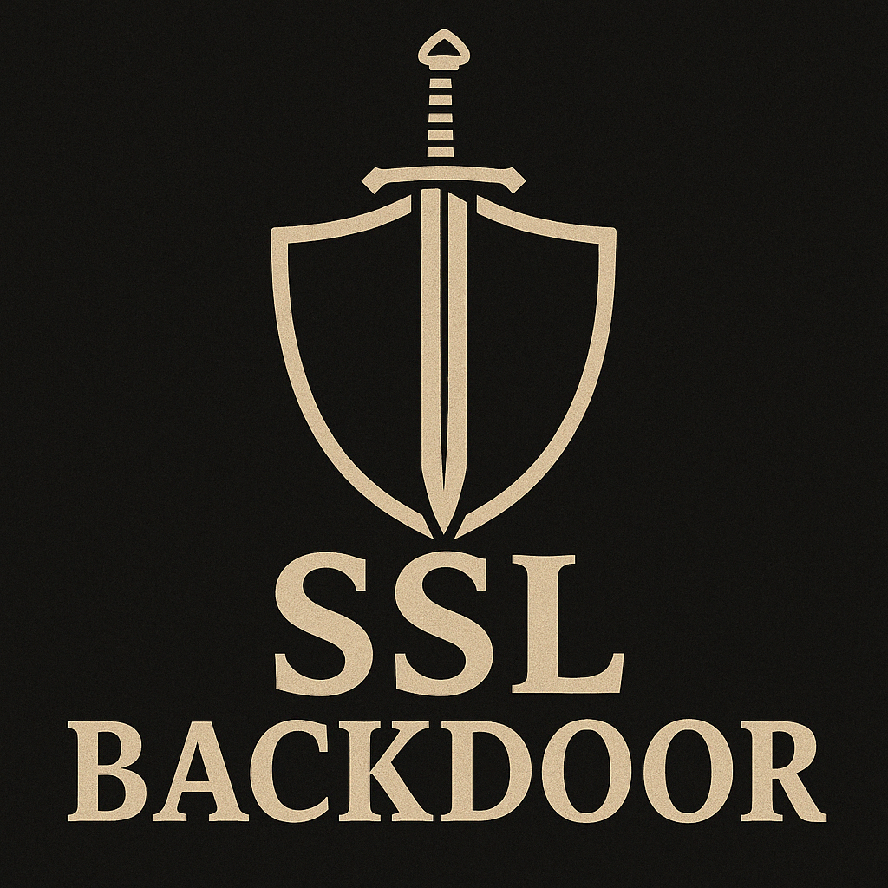

<p align="center">
  
</p>

<p align="center">
  <a href="LICENSE">
    
  </a>
  <a href="https://github.com/jsrdcht/SSL-Backdoor/stargazers">
    
  </a>
  
</p>

# SSL-Backdoor

SSL-Backdoor is an academic research library for **backdoor attacks in self-supervised learning (SSL)**. Our goal is to provide a comprehensive and unified platform for researchers to implement, evaluate, and compare various attacks and defenses in the context of SSL.

## 📢 What's New?

✅ **2025-12-02 Update:**

* **SSL-Cleanse is now available!** See paper: [SSL-Cleanse: Trojan detection and mitigation in self-supervised learning](https://link.springer.com/chapter/10.1007/978-3-031-73021-4_24)


✅ **2025-08-11 Update:**

* **DRUPE attack is now implemented and available!** See paper: [Distribution Preserving Backdoor Attack in Self-supervised Learning](https://www.computer.org/csdl/proceedings-article/sp/2024/313000a029/1RjEa5rjsHK)

✅ **2025-05-19 Update:**

* **DEDE defense is now implemented and available!**

✅ **2025-04-18 Update:**

* **PatchSearch defense is now implemented and available!**
* **BadEncoder attack is now implemented and available!**

## Supported Attacks

This library currently supports the following poisoning attack algorithms against SSL models:

| Aliase       | Paper                                                                                                                                                              | Conference | Config |
|-----------------|----------------------------------------------------------------------------------------------------------------------------------------------------------------------|------------|--------|
| SSLBKD          | [Backdoor attacks on self-supervised learning](https://doi.org/10.1109/CVPR52688.2022.01298)                                                                              | CVPR 2022  | [config](configs/poisoning/poisoning_based/sslbkd.yaml) |
| CTRL            | [An Embarrassingly Simple Backdoor Attack on Self-supervised Learning](https://openaccess.thecvf.com/content/ICCV2023/html/Li_An_Embarrassingly_Simple_Backdoor_Attack_on_Self-supervised_Learning_ICCV_2023_paper.html) | ICCV 2023  |  |
| CorruptEncoder  | [Data poisoning based backdoor attacks to contrastive learning](https://openaccess.thecvf.com/content/CVPR2024/html/Zhang_Data_Poisoning_based_Backdoor_Attacks_to_Contrastive_Learning_CVPR_2024_paper.html)       | CVPR 2024  |  |
| BLTO (inference)| [BACKDOOR CONTRASTIVE LEARNING VIA BI-LEVEL TRIGGER OPTIMIZATION](https://openreview.net/forum?id=oxjeePpgSP)                                                              | ICLR 2024  |  |
| BadEncoder | [BadEncoder: Backdoor Attacks to Pre-trained Encoders in Self-Supervised Learning](https://ieeexplore.ieee.org/abstract/document/9833644/) | S&P 2022| [config](configs/attacks/badencoder.py) |
| DRUPE | [Distribution Preserving Backdoor Attack in Self-supervised Learning](https://www.computer.org/csdl/proceedings-article/sp/2024/313000a029/1RjEa5rjsHK) | S&P 2024 | [config](configs/attacks/drupe.py), [train](configs/attacks/drupe_train.yaml), [test](configs/attacks/drupe_test.yaml) |

## Supported Defenses

We are actively developing and integrating defense mechanisms. Currently, the following defense is implemented:

| Aliase        | Paper                                                                                                      | Conference                         |    Config      |
|------------------|------------------------------------------------------------------------------------------------------------------|---------------------------------------|----------------|
| PatchSearch    | [Defending Against Patch-Based Backdoor Attacks on Self-Supervised Learning](https://openaccess.thecvf.com/content/CVPR2023/html/Tejankar_Defending_Against_Patch-Based_Backdoor_Attacks_on_Self-Supervised_Learning_CVPR_2023_paper.html)                                       | CVPR2023 |   [doc](./docs/zh_cn/patchsearch.md), [config](configs/defense/patchsearch.py)     |
| DEDE | [DeDe: Detecting Backdoor Samples for SSL Encoders via Decoders](http://arxiv.org/abs/2411.16154) | CVPR2025 |   [config](configs/defense/dede.py)     |
| SSL-Cleanse | [SSL-Cleanse: Trojan detection and mitigation in self-supervised learning](https://link.springer.com/chapter/10.1007/978-3-031-73021-4_24) | ECCV2024 |   [config](configs/defense/ssl_cleanse.py)     |

## Setup

Get started with SSL-Backdoor quickly:

1.  **Clone the repository:**
    ```bash
    git clone https://github.com/jsrdcht/SSL-Backdoor.git
    cd SSL-Backdoor
    ```

2.  **Environment (Pixi CUDA only):**
    ```bash
    # resolve/create the CUDA environment defined in pixi.toml
    pixi install -e cuda
    # quick check of core deps and CUDA availability
    pixi run -e cuda check
    # open an interactive shell in the CUDA env (optional)
    pixi shell -e cuda
    ```

## Usage

### Training an SSL Model on a Poisoned Dataset

To train an SSL model (e.g., using MoCo v2) with a chosen poisoning attack, you can use the provided scripts. Example for Distributed Data Parallel (DDP) training:

```bash
# Configure your desired attack, SSL method, dataset, etc. in the relevant config file
# (e.g., configs/ssl/moco_config.yaml, configs/poisoning/...)

bash tools/train.sh <path_to_your_config.yaml>
```

*Please refer to the `configs` directory and specific training scripts for detailed usage and parameter options.*


# Citation

```bibtex
@misc{jsrdcht_ssl_backdoor_2025,
  title        = {SSL-Backdoor: A PyTorch library for SSL backdoor research},
  author       = {jsrdcht},
  year         = {2025},
  howpublished = {\url{https://github.com/jsrdcht/SSL-Backdoor/}},
  note         = {MIT License, accessed 2025-08-11}
}
```